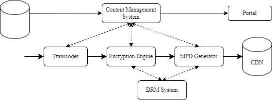
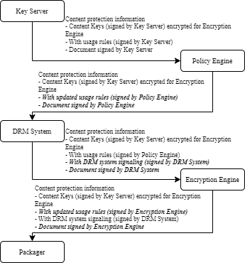
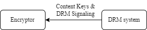
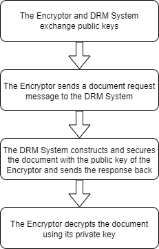
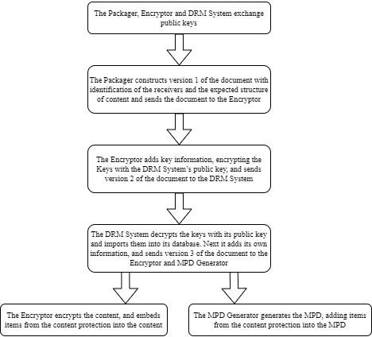
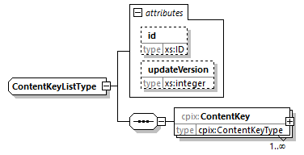
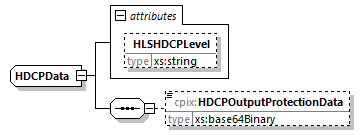
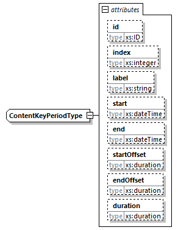

<pre class="metadata">
Title: DASH-IF Implementation Guidelines: Content Protection Information Exchange Format (CPIX)
Date: 2024-09-30
Editor: DASH Industry Forum
Status: LS-COMMIT
Shortname: cpix
Issue Tracking: GitHub https://github.com/Dash-Industry-Forum/CPIX/issues
Repository: GitHub https://github.com/Dash-Industry-Forum/CPIX

Default Highlight: text
Line Numbers: off
Markup Shorthands: markdown yes
Boilerplate: copyright no, abstract no, index no, conformance no, header yes
Abstract: None
Image Auto Size: false
</pre>

<pre boilerplate="logo">
	
</pre>

# Scope # {#scope}

The scope of this document is to define a Content Protection Information Exchange Format (CPIX). A CPIX document contains keys and DRM information used for encrypting and protecting content and can be used for exchanging this information among entities needing it in many possibly different workflows for preparing, for example, DASH or HLS content. The CPIX document itself can be encrypted, signed and authenticated so that its receivers can be sure that its confidentiality, source and integrity are also protected.

This specification describes version 2.4 of the CPIX document format. 

Detailed changes with respect to version 2.3.1 are tracked on [GitHub](https://github.com/Dash-Industry-Forum/CPIX/issues). Highlighted changes are:

* Added the option to encrypt Content Keys with different Document Keys, see clauses [[#schema-datamodel-deliverydatalist]] and [[#keys-enc-keytypes]]
* Added the option to have in one document with Content Keys for different content, allowing the bulk transfer of content keys information in one document, hence adding a `@contentId`under the `ContentKey` element, see clause [[#usecases-exchange-multipleassets]] and [[#schema-datamodel-contentkey]]
* Added HDCP information attached to the Content Key to be inserted in both HLS playlist and DASH MPD, see clause [[#schema-datamodel-HDCPdata]]
* Added expected DRM robustness information to be inserted in both HLS playlist and DASH MPD, see clause [[#schema-datamodel-drmsystem]] and [[#schema-datamodel-contentprotectiondata]]
* Simplified the `ContentKey` element by removing all non-used element inherited from the PSCK model, see clause [[#schema-datamodel-contentkey]]
* Updated the HLS terminology to `multiVariant`, see clause [[#schema-datamodel-HLSsignalingdata]]
* Removed the signaling for HDS and the deprecated `URIExtXKey` for HLS, see clause [[#schema-datamodel-drmsystem]]
* Updated references

Detailed changes with respect to version 2.3 are tracked on [GitHub](https://github.com/Dash-Industry-Forum/CPIX/issues). Highlighted changes are:

* Clarified that key ids shall be UUID as described in [[!MPEGCENC]] (added a constraint)
* Corrected a bug on `@periodId` that shall be a XS:REFID, see clause [[#schema-datamodel-usagerulefilter-keyperiodfilter]]
* Clarification on the `@explicitIV` attribute under the `ContentKey` element encoding, see clause [[#schema-datamodel-contentkey]]
* Taking into account the scenario described in Clause 9 of [[!DASHIF-IOPv5p6]] for key rotation, clarification for the `PSSH` and `ContentProtectionData` content under `DRMSystem`. A clause is also added on this topic. See clause [[#schema-datamodel-drmsystem]] and [[#keys-rotation]]
* Clean-up the Use Cases and Requirements clause (removed the electronic sell through use case)
* Addition of the `@version` attribute under the `CPIX` element, see clause [[#schema-datamodel-cpix]]
* Addition of a clause on using the same content key with different encryption schemes, see clause [[#keys-encryptionScheme]]
* Updated references

# Disclaimer # {#disclaimer}

This is a document made available by DASH-IF. The technology embodied in this document may involve the use of intellectual property rights, including patents and patent applications owned or controlled by any of the authors or developers of this document. No patent license, either implied or express, is granted to you by this document. DASH-IF has made no search or investigation for such rights and DASH-IF disclaims any duty to do so. The rights and obligations which apply to DASH-IF documents, as such rights and obligations are set forth and defined in the DASH-IF Bylaws and IPR Policy including, but not limited to, patent and other intellectual property license rights and obligations. A copy of the DASH-IF Bylaws and IPR Policy can be obtained at https://dashif.org/.

The material contained herein is provided on an AS IS basis and to the maximum extent permitted by applicable law, this material is provided AS IS, and the authors and developers of this material and DASH-IF hereby disclaim all other warranties and conditions, either express, implied or statutory, including, but not limited to, any (if any) implied warranties, duties or conditions of merchantability, of fitness for a particular purpose, of accuracy or completeness of responses, of workmanlike effort, and of lack of negligence.

In addition, this document may include references to documents and/or technologies controlled by third parties.Those third party documents and technologies may be subject to third party rules and licensing terms. No intellectual property license, either implied or express, to any third party material is granted to you by this document or DASH-IF. DASH-IF makes no any warranty whatsoever for such third party material.

# Normative Language # {#norme}

In the present document **shall**, **shall not**, **should**, **should not**, **may**, **need not**, **will**, **will not**, **can** and **cannot** are to be interpreted as described in clause 3.2 of the [ETSI Drafting Rules](https://portal.etsi.org/Services/editHelp!/Howtostart/ETSIDraftingRules.aspx) (Verbal forms for the expression of provisions).
**must** and **must not** are NOT allowed in deliverables except when used in direct citation.

# Introduction # {#intro}

This document defines a container allowing the exchange between entities of content protection information typically made of keys used for encrypting content and any associated DRM specific information. There may be one or several keys and these keys may be protected by one or several DRMs, hence there may be one or several DRM specific information. There is no assumption on the entities exchanging this information but it is not expected that a client device will use this exchange format. The goal is to allow entities involved in the content preparation workflow to get the content protection information so that, for example a DASH MPD can be generated with all content protection information.

Because the defined container is not made for a specifically defined content preparation workflow but is generic, conformance is not considered to be a critical part of CPIX. As a consequence, no conformance is defined for this specification.

# Definition of Terms # {#terms}

: Content
:: One or more audio-visual elementary streams and the associated MPD if in DASH format.
: Content Key
:: A cryptographic key used for encrypting part of the Content.
: Content Key Context
:: The portion of a media stream which is encrypted with a specific Content Key.
: Content Protection
:: The mechanism ensuring that only authorized devices get access to Content.
: Document Key
:: A cryptographic key used for encrypting the Content Key(s) in the CPIX document.
: DRM Signaling
:: The DRM specific information to be added in Content for proper operation of the DRM system when authorizing a device for this Content. It is made of proprietary information for licensing and key retrieval.
: PSSH
:: Protection System Specific Header box that is part of an ISOBMFF file. This box contains DRM Signaling.

# Use Cases and Requirements # {#usecases}

## Introduction ## {#usecases-intro}

Content Keys and DRM Signaling, a.k.a. content protection information need to be created and exchanged between some system entities when preparing Content. The flows of information are of very different nature depending on where Content Keys are created and also depending on the type of Content that can be either On-Demand or Live.

This clause presents different use cases where such exchanges are required. [[#usecases-architecture]] is an overview of the general context in which exchange of content protection information is happening, [[#usecases-packaging]] describes some workflows for content creation and [[#usecases-exchange]] goes in the details of how content protection information can be exchanged over an interface between two entities.

## Overview of the End to End Architecture ## {#usecases-architecture}

This clause gives a general overview of the context in which content protection information need to be exchanged between entities in the backend. It completes clause 4 of [[!DASHIF-IOPv5p6]] by putting more emphasis on the backend aspects.

This clause takes DASH content as an example for providing more specific and clear understanding, but this can be generalized to other streaming formats, such as HLS [[!HLS]].

<figure>
	
	<figcaption>Logical roles that exchange DRM information and media.</figcaption>
</figure>

The figure above shows logical entities that may send or receive content protection information such as content keys, asset identifiers, licenses, and DRM signaling (license acquisition information for example). A physical entity may combine multiple logical roles, and the point of origin for information, such as content keys and asset identifiers, can differ; so various information flows are possible. This is an example of how the roles are distributed to facilitate the description of workflow and use cases. Alternative roles and functions can be applied to create conformant content. The different roles are:

: Content Provider
:: A publisher who provides the rights and rules for delivering protected media, also possibly source media (mezzanine format, for transcoding), asset identifiers, key identifiers (KID), content key values, encoding instructions, and content description metadata.

: Encoder
:: A service provider who encodes media in a specified set of formats with different bitrates and resolutions etc., possibly determined by the publisher.

: Packager / Encryptor
:: A service provider who encrypts and packages media, inserting DRM Signaling and metadata into the media files. In the case of DASH packaging, this consists of adding the default_KID in the file header `tenc` box, initialization vectors (IV) and subsample byte ranges in track fragments indexed by `saio` and `saiz` boxes, and possibly one or more `pssh` boxes containing license acquisition information (from the DRM Service). Tracks that are partially encrypted or encrypted with multiple keys require sample to group boxes and sample group description boxes in each track fragment to associate different KIDs to groups of samples. The Packager could originate values for KIDs, Content Keys, encryption layout, etc., then send that information to other entities that need it, including the DRM Service, and probably the Content Provider. However, the Packager could receive that information from a different point of origin, such as the Content Provider or DRM Service.

: Manifest Creator
:: A service provider which generates the media manifests which group the various media files into a coherent presentation. These manifest files may contain DRM signaling information. For DASH, the MPD Creator is assumed to create one or more types of DASH MPD files and provide indexing of segments and/or `sidx` indexes for download so that players can byte range index subsegments. The MPD shall include descriptors for Common Encryption and DRM systems and should include identification of the `@default_KID` for each `AdaptationSet` element, and sufficient information in `ContentProtection` elements to acquire a DRM license. The `@default_KID` is available from the Packager and any other role that created it, and the DRM signaling is available from the DRM Service.

: DRM Client
:: It gets information from different sources: media manifest files, media files, and DRM licenses.

: DRM Service
:: The DRM Service creates licenses containing a protected Content Key that can only be decrypted by a trusted DRM Client. It needs to know the `@default_KID` and DRM systemID and possibly other information like asset ID in order to create and download one or more licenses required for a `Presentation` on a particular device. Each DRM system has different license acquisition information, a slightly different license acquisition protocol, and a different license format with different playback rules, output rules, revocation and renewal system, etc. For DASH, the DRM Service typically shall supply the Packager license acquisition information for each `ContentProtection` element or `pssh` box, respectively. The DRM Service may also provide logic to manage key rotation, DRM domain management, revocation and renewal and other Content Protection related features.

## Use Cases for the Preparation of Content ## {#usecases-packaging}

### Introduction ### {#usecases-packaging-intro}

This clause describes some workflows for content preparation where content protection information is exchanged between or carried through some entities.

As for the previous clause, this clause takes DASH content as an example for providing more specific and clear understanding, but this can be generalized to other streaming formats, such as HLS.

### On-Demand Content ### {#usecases-packaging-ondemand}

The flow for preparing On-Demand Content requires that a media asset is available non-encrypted, ideally in the maximum resolution so that an adaptive streaming presentation can be prepared.

One possible flow is that a Content Management System (CMS) creates a workflow ensuring that DASH Content is prepared. The CMS makes the file available to a transcoder. The transcoder outputs the segmented files that can be encrypted. The encryption engine either generates the Content Keys or requests them from a DRM system. The DRM system also provides `pssh` boxes to be added to the media files, as well as `ContentProtection` elements to be added to the MPD file. When the encrypted DASH Content is ready, the MPD is generated by a MPD Generator It asks the DRM system the required DRM Signaling to be added in the MPD. DASH content is then uploaded by the CMS on a CDN making it available to users. In parallel, editorial metadata is exported to the Portal, enabling access to users. DRM systems receive relevant metadata information that needs to be included in the license (output controls) when creating a license.

This flow is summarized in the figure below where arrows show the flow of information.

<figure>
	
	<figcaption>Example of workflow for On-Demand Content preparation.</figcaption>
</figure>

### Live Content ### {#usecases-packaging-live}

Metadata is regularly imported with new or updated information. Metadata can include different type of information on the EPG events such as the duration of the event, the list of actors, the output controls usage rules, a purchase window, etc.

Content is continuously received, transcoded in the desired format and encrypted if any type of entitlement is required.

One or many Content Keys can be used if key rotation is used or not. Such setting is static and configuration is hard-coded in the relevant equipment, hence a Content Management System is not required for this workflow to operate. As for Content on-Demand, keys are generated by the encryption engine or the DRM system and are available to all DRM systems and the encryption engine at the right moment depending on how these keys are used. The encoder requests to the DRM systems their specific signaling, if any, to be added in the MPD.

Encrypted segments and the media manifest are uploaded on a CDN making it available to users.

Metadata is exported to the Portal, enabling access to users. DRM systems receive relevant metadata information that needs to be included in the license (output controls).

This flow is summarized in the figure below where arrows show the flow of information.

<figure>
	
	<figcaption>Example of workflow for Live Content preparation.</figcaption>
</figure>

### Catch-up ### {#usecases-packaging-catchup}

Live Content has already been encoded and encrypted (if required) for Live unicast. All DRM systems have access to the keys.

Additional metadata may be required for ensuring that events are effectively available in catch-up. These are made available to the Portal and some Live events are identified as being able to be replayed as On-demand. Optionally, the operator may choose to replace the advertising content with targeted ads.

## Exchange over an Interface ## {#usecases-exchange}

### Introduction ### {#usecase-exchange-intro}

This clause gives details on how content protection information is exchanged or transferred over an interface between two or more entities.

### Content Key Delivery to One Entity ### {#usecases-exchange-deliverytoone}

In the simplest use case, content protection information is made of a Content Key. One entity sends a Content Key to the other entity.

<figure>
	
	<figcaption>Content Key delivery to one entity.</figcaption>
</figure>

The primary data model carried by content protection information document is made of one to many Content Keys with their associated KIDs. Any context or meaning is attributed externally. The document simply serves as a standard way to serialize Content Keys for delivery.

### Secure Content Key Delivery to Several Entities ### {#usecases-exchange-securedeliverytomany}

This use case is an extension of clause [[#usecases-exchange-deliverytoone]] and is compatible with the use cases presented in the following clauses.

<figure>
	
	<figcaption>Secure Content Key delivery to several entities.</figcaption>
</figure>

The entities exchanging Content Keys may want to rely upon a trust relationship that ensures authentication and privacy of communications. Such a mechanism can be provided by the communication protocol used to deliver the document but the document can also be self-protected. CPIX documents can deliver Content Keys in encrypted and digitally signed form, enabling confidentiality, authentication and nonrepudiation.

In situations with more than one recipient, the document allows each one to decrypt the Content Keys using its own private key.

### Content Key Delivery with Usage Rules ### {#usecases-exchange-usagerules}

#### Introduction #### {#usecases-exchange-usagerules-intro}

These use cases are extension of [[#usecases-exchange-deliverytoone]] and present different rules that can be applied on a Content Key when delivered to an entity. Each usage rule defines a set of filters that are used to define a Content Key Context. If a rule match is found, the Content Key referenced by the usage rule is to be used to encrypt the Content Key Context defined by the rule.

<figure>
	
	<figcaption>Content Key delivery with key usage rules.</figcaption>
</figure>

#### Label Filter #### {#usecases-exchange-usagerules-labelfilter}

This use case adds information to Content Keys that specifies how they are to be mapped to labelled Content Key Contexts, where the labeling system has been pre-agreed between the producer and consumer of the CPIX document.

For example, labels might be the IDs of DASH adaptation sets or, for more compatibility with formats other than DASH, names of media files/directories or input values for arbitrary custom logic.

The recipient will use the added information to map Content Keys to Content Key Contexts defined by labels.

#### Key Period Filter #### {#usecases-exchange-usagerules-periodfilter}

This use case adds information to Content Keys that specifies how they are to be mapped to key periods, a.k.a. crypto-periods for Content Key rotation. The mapping is accomplished by defining key periods and mapping Content Keys to any number of key periods.

The recipient will use the added information to map Content Keys to time periods.

#### Policy-based Filters #### {#usecases-exchange-usagerules-policyfilters}

This use case associates policy-based information with Content Keys, constraining how they define Content Key Contexts. Policy based filters are, for example, video or audio stream attributes and bitrate ranges.

The recipient will use the added information to map Content Keys to Content Key Contexts according to the defined policy.

Having no policy in some dimension means that the Content Key Context is not constrained in that dimension. For example, if the HDR policy is not specified, the Content Key Context may include both HDR and non-HDR media.

### Content Key Delivery with DRM Signaling ### {#usecases-exchange-drmsignaling}

This use case is an extension of [[#usecases-exchange-deliverytoone]] and is compatible with [[#usecases-exchange-usagerules]].

This use case adds DRM Signaling information to each Content Key. The recipient may embed this signaling into the data streams it generates.

<figure>
	
	<figcaption>Content Key Delivery with DRM Signaling.</figcaption>
</figure>

The primary data model carried by content protection information document needs then to include zero to many DRM system signaling elements, each element consisting of a DRM system ID, some signaling information such as for example signaling data for a DASH manifest or an HLS playlist or signaling data for an ISOBMFF file.

The use of 3rd party extensions enable the inclusion of DRM system signaling in forms suitable for other media delivery technologies.

The recipient may use the part of signaling data that it understands and knows how to embed into its output, ignoring signaling data that targets other media delivery technologies.

### Incremental Update and Extension of the Document ### {#usecases-exchange-incrementalauthoring}

This use case illustrates the usage of the content protection information document in a realistic workflow comprising multiple cooperating components that require a standardized data format for content protection information exchange.

<figure>
	
	<figcaption>Incremental update and extension of the document.</figcaption>
</figure>

Each component participating in such a workflow is the authority on a particular aspect. For example, the Key Server manages Content Keys and usage rules and may define the key periods, the DRM System knows how to define the correct DRM Signaling and the Encryption Engine might want to inform the Packager what representations the Content Keys actually got mapped to (the Packager might not have enough information to resolve usage rules based on detailed metadata, so the Encryption Engine could define a new set of usage rules that are simple enough for the Packager to understand, e.g. by making use of label filters).

As the document travels in the workflow, each component adds the elements containing the content protection items it generates (key periods, usage rules, Content Keys, DRM Signaling, etc), making it suitable for the next component that will make use of it. After each modification, the added elements may be signed to maintain a chain of trust on each set of elements individually. The document in its entirety may also be signed to authenticate the document as a whole.

Note that in the above example, the Content Key material itself is encrypted for the Encryption Engine. Despite the fact that many other components participate in the workflow, they do not have access to Content Keys.

### Multiple Content Keys Delivery for Multiples Assets ### {#usecases-exchange-multipleassets}

This use case is for the bulk transfer of Content Keys in one document. Each Content Key is associated to a different media asset, hence within the document, several media assets can be referenced. Limiting the number of documents to exchange allows for simpler transfer between entities of Content Keys and associated information such as usage rules and DRM signaling.

<figure>
	
	<figcaption>Bulk transfer of Content Keys referencing different assets.</figcaption>
</figure>

### Content Key Hierarchy Delivery for Content Packaging ### {#usecases-exchange-hierarchydelivery}

Some DRM systems enable the use of hierarchy of keys, where the set of keys delivered to clients (root keys) within licenses differs from the set of keys used to encrypt Content (leaf keys). Doing so enables DRM systems to separate content encryption and commercial offer management.

Packaging content that uses a key hierarchy requires the Packager to know:

* The leaf keys.
* The KIDs of the root keys (but not the root keys themselves).
* DRM system signaling data for both root and leaf keys.

To fulfill this use case, CPIX enables the above data to be exchanged.

### Root Key Delivery for License Server Operation ### {#usecases-exchange-rootkeydelivery}

Some DRM systems enable the use of hierarchical keys, where the set of keys delivered to clients (root keys) differs from the set of keys used to encrypt Content (leaf keys).

When, for example, key creation is not a function of the license server, creating licenses in scenarios that use hierarchical keys requires the license server to know the root keys. CPIX enables root keys to be delivered to license servers.

The exchange of root keys is technically identical to the exchange of non-hierarchical Content Keys as described in [[#usecases-exchange-deliverytoone]]. It is expected that the recipient of a CPIX document in this use case is already aware of the hierarchical nature of the keys within, without any signaling in the CPIX document.

## Workflow Examples ## {#usecases-workflows}

### Encryptor Producer and Encryptor Consumer ### {#usecases-workflows-encryptorandproducer}

#### Introduction #### {#usecases-workflows-encryptorandproducer-intro}

There are many workflows that are possible, depending on which entities provide information in the CPIX document, and which entities consume that information. Two simple single-producer, single-consumer examples are illustrated below:

<figure>
	
	<figcaption>Encryptor Producer.</figcaption>
</figure>

<figure>
	
	<figcaption>Encryptor Consumer.</figcaption>
</figure>

All workflows require that content protection information and Content Keys be exchanged between two or more entities. In the examples above the entities are the Encryptor and DRM System:

* The Encryptor Producer example allows, in this case, the Encryptor to generate Content Keys and to push them to one or many DRM systems. The Encryptor could expect to receive from the DRM systems some DRM Signaling.
* The Encryptor Consumer example allows the Encryptor to pull Content Keys and DRM Signaling from a DRM system. In this case, Content Keys are generated by the DRM System.

The document allows supporting both workflows above in addition to other workflows not explicitly described here.

Before exchanging key information in a secure manner, the entities which exchange key material musshallt know about each other and share public keys so that one entity could encrypt data and the other entity could decrypt it. This important step of Trust establishment is out of the scope of this document.

#### Encryptor Producer #### {#usecases-workflows-encryptorandproducer-encryptorproducer}

This clause shows a possible workflow for securing the exchange of the key information between entities when the Encryptor generates the Content Keys. In this example, the Encryptor is the entity which is taking responsibility for generating the Content Keys, protecting them and pushing them to the DRM Systems.

* The first step is the Trust establishment. Public keys shall be exchanged between two or more entities (the Encryptors and the DRM Systems) prior exchanges.
* Once the Trust is established and the necessary associated key material is shared between entities, Content Keys can be exchanged. The Encryptor is encrypting these keys using DRM Systems public keys. The DRM Systems can decrypt using their own private key.
* The Encryptor provides crypto material required to uniquely identify the entity capable of decrypting the media.

All these steps are summarized in the figure below.

<figure>
	
	<figcaption>Encryptor Producer example steps.</figcaption>
</figure>

#### Encryptor Consumer #### {#usecases-workflows-encryptorandproducer-encryptorconsumer}

This clause shows a possible workflow for securing the exchange of the key information between entities when the DRM System generates the Content Keys. In this model, the Encryptor can pull documents directly from a DRM System. In this case, the DRM System is generating Content Keys and is encrypting them for a secure delivery to the Encryptor.

* As in the case of the Encryptor Producer model, the first step is the Trust establishment. Public keys shall be exchanged between two or more entities (the Encryptors and the DRM System) prior exchanges.
* The DRM System will use the public key of the Encryptor to encrypt keys to be inserted in the document and will send it to Encryptor.
* The Encryptor can decrypt the Content Keys using its private key.

All these steps are summarized in the figure below.

<figure>
	
	<figcaption>Encryptor Consumer example steps.</figcaption>
</figure>

### Multiple Producers ### {#usecases-workflows-multipleproducers}

This clause illustrates that it is possible to have more complex workflows than those previously illustrated. In one such example, for DASH content, a media packager might define the types of streams in the presentation, an Encryptor might generate the Content Keys, a DRM System might generate other DRM Signaling, An Encryptor and an MPD Generator might be the consumers of the final document. In such workflows, the document gets passed from entity to entity in sequence, with each entity adding top-level elements, and recording the update.

<figure>
	
	<figcaption>Multiple Producers example.</figcaption>
</figure>

* The first step is the Trust establishment. Public keys shall be exchanged between two or more entities prior to exchanges.
* Once the Trust is established and the necessary associated key material is shared between entities, Content Keys can be exchanged.
* The Packager provides identification of the receivers and the various stream encoding criteria (usage rules) in version 1 of the document.
* The Encryptor adds key information in version 2 of the document. These elements only contain Keys and no DRM information.
* The DRM System imports the Content Keys stored in the document, and adds its own information in version 3 of the document, which is the finalized version.
* The Encryptor extracts content protection information from the document to be embedded in the media (e.g. `pssh` boxes).
* The MPD Generator also extracts content protection related information from the document to be embedded in the MPD document (e.g. `pssh` boxes, key IDs).

All these steps are summarized in the figure below.

<figure>
	
	<figcaption>Multiple Producers example steps.</figcaption>
</figure>

# XSD Schema Definition # {#schema}

## Introduction ## {#schema-intro}

This clause describes the Content Protection Information eXchange (CPIX) format to provide a framework to securely exchange Content Key(s) and DRM Signaling between different system entities (see clause [[#usecases]]). This is an XML file. This clause describes in details elements part of the schema.

## Requirements ## {#schema-requirements}

It shall be possible to exchange Content Key(s) and DRM Signaling between entities involved in Content preparation workflows, an example of such interface where the exchange shall be possible is between a DRM system and the encryption engine.

It shall be possible that the manifest generator receives DRM Signaling for several DRM systems and/or content formats.

Update of Content Key(s) shall be possible at periodic time or based on events. Some period of time could be in the clear (no encryption).

It shall allow generating MPD conformant to [[!DASHIF-IOPv5p6]].

Content Key(s) shall be secured over the interface.

Entities exchanging content protection information should be authenticated.

## Structure Overview ## {#schema-structure}

The structure is articulated around Content Keys and the accompanying material. The document contains all the information required for allowing any entitled entity to get access to or add in the Content Keys and either consume or add material, such as time constraint, DRM information to the CPIX document. The same XML file can be shared between several receiving entities. Hence, each one shall be able to decrypt keys and shall be properly identified.

Taking this into account, the CPIX document contains lists of elements:

* `DeliveryDataList`: This list contains instances of `DeliveryData`, each of which describes an entity entitled to decrypt Content Keys contained in the CPIX document.
* `ContentKeyList`: This list contains instances of `ContentKey`, each of which contains a Content Key used for encrypting media.
* `DRMSystemList`: This list contains instances of `DRMSystem`, each of which contains the signaling data to associate one DRM system with one Content Key.
* `ContentKeyPeriodList`: This list contains instances of `ContentKeyPeriod`, each of which defines a time period that may be referenced by the key period filters included in Content Key usage rules.
* `ContentKeyUsageRuleList`: This list contains instances of `ContentKeyUsageRule`, which maps a Content Key to one or more Content Key Contexts.
* `UpdateHistoryItemList`: This list contains instances of `UpdateHistoryItem`, each of which contains an update version number and an identifier of the entity which produced the update. Other elements in the document are linked to a specific update by update version number (via the `@updateVersion` attribute).
* `Signature`: Each instance of this element contains a digital signature [[!XMLDSIG-CORE]] over either the entire document or a subset of XML elements.

The Content Keys can be encrypted inside the XML file using the public keys of the recipients, identified in the `DeliveryData` elements. The XML file also allows storing the Content Keys in the clear, in which case the security of the Content Keys is contingent on the security of the communication channel used to deliver the CPIX document to the recipients.

The figure below shows the first elements and a high-level view of the structure. Detailed description of the structure is given in the following clauses.

<figure>
	
	<figcaption>Content Protection Information Exchange Format high level view.</figcaption>
</figure>

## Hierarchical Data Model ## {#schema-datamodel}

### Introduction### {#schema-datamodel-intro}

In this clause, the following conventions are used:

* Element names are in `PascalCase` and the number of allowed instances is defined by (`min...max`) where N for `max` means unbounded.
* Attribute names are in `camelCase` preceded with an `@` and the use of an attribute is defined as: M=Mandatory, O=Optional, OD=Optional with Default Value, CM=Conditionally Mandatory. Attributes may be in any order.

The XSD schema for this model is provided [here](https://dashif.org/guidelines/others/#dash-if-content-protection-information-exchange-format).

In addition to types defined in this document that come with the prefix `cpix:`, , the CPIX data model references types defined in [[!XMLSCHEMA11-2]], [[!RFC6030]], [[!XMLDSIG-CORE]] and [[!XMLENC-CORE]]. External data types are prefixed with `xs:`, `pskc:`, `ds:` and `xenc:` respectively.

### `CPIX` Element### {#schema-datamodel-cpix}

The root element that carries the Content Protection Information for a set of media assets.

: `@id (O, xs:ID)`
:: An identifier for the CPIX document. It is recommended to use an identifier that is unique within the scope in which this file is published.

: `@contentId (O, xs:string)`
:: An identifier for the asset or content that is protected by the keys carried in this CPIX document. It is recommended to use an identifier that is unique within the scope in which this file is published. It is mutually exclusive with the attribute `@contentId` defined in the `ContentKey` element.

: `@name (O, xs:string)`
:: A name for the presentation.

: `@version (O, xs:string)`
:: A version for the CPIX document. The value shall reference a published version of the CPIX guidelines and be structured as majorVersion.minorVersion. This specification describes version 2.4.
:: If the CPIX client knows that it doesn't support all the features of a given CPIX version, it needs to behave according to the recommendations of the API used to exchange the CPIX document.

: `DeliveryDataList (0...1, cpix:DeliveryDataList)`
:: A container for `DeliveryData` elements. If not present, Content Keys in the document are delivered in the clear, without encryption.

: `ContentKeyList (0...1, cpix:ContentKeyList)`
:: A container for `ContentKey` elements.

: `DRMSystemList (0...1, cpix:DRMSystemList)`
:: A container for `DRMSystem` elements. If not present, the document does not contain any DRM system signaling data.

: `ContentKeyPeriodList (0...1, cpix:ContentKeyPeriodList)`
:: A container for `ContentKeyPeriod` elements.

: `ContentKeyUsageRuleList (0...1, cpix:ContentKeyUsageRuleList)`
:: A container for `ContentKeyUsageRule` elements. If not present, the document does not define Content Key Contexts and an external mechanism is required for synchronizing the content creation workflow.

: `UpdateHistoryItemList (0...1, cpix:UpdateHistoryItemList)`
:: A container for `UpdateHistoryItem` elements.

: `Signature (0...N, ds:Signature)`
:: Digital signatures as defined in [[!XMLDSIG-CORE]]. Each signature signs either the full document or any set of elements within the CPIX document. Every digital signature shall contain an X.509 certificate identifying the signer and the associated public key.

<figure>
	
	<figcaption>CPIX element.</figcaption>
</figure>

### `DeliveryDataList` Element ### {#schema-datamodel-deliverydatalist}

: `@id (O, xs:ID)`
:: An identifier for the element. It is recommended to use an identifier that is unique within the scope in which this CPIX document is published.

: `@updateVersion (O, xs:integer)`
:: Matches the `@updateVersion` attribute of the `UpdateHistoryItem` element providing details on when this element was added or updated.

: `DeliveryData (1...N, cpix:DeliveryData)`
:: Contains the required information allowing defining which entities can get access to the Content Keys delivered in this document.
:: There is one `DeliveryData` element per entity capable of accessing encrypted Content Keys stored in this document. If this element is not present, then the Content Keys are in the clear in the file.

<figure>
	
	<figcaption>DeliveryDataList element.</figcaption>
</figure>

### `DeliveryData` Element ### {#schema-datamodel-deliverydata}

: `@id (O, xs:ID)`
:: An identifier for the element. It is recommended to use an identifier that is unique within the scope in which this CPIX document is published.

: `@updateVersion (O, xs:integer)`
:: Matches the `@updateVersion` attribute of the `UpdateHistoryItem` element providing details on when this element was added or updated.

: `@name (O, xs:string)`
:: Name of the Delivery Data.

: `DeliveryKey (1, ds:KeyInfoType)`
:: Contains an X.509 certificate that identifies the intended recipient and the public key that was used to encrypt the Document Key.
:: Refer to [[#keys-enc]] for a description of the key management within the CPIX document.

: `DocumentKey (1...N, cpix:DocumentKeyType)`
:: Contains the keys that are used for encrypting the Content Key stored in `ContentKey` elements.

: `MACMethod (0...1, pskc:MACMethodType)`
:: Identifies the MAC algorithm and contains the MAC key used to implement authenticated encryption of Content Keys. The key in the MACKey element is encrypted using the public key listed in the recipient’s X.509 certificate from the DeliveryKey element.
:: Refer to [[#keys-enc]] for a description of the key management within the CPIX document.

: `Description (0...1, xs:string)`
:: A description of the element.

: `SendingEntity (0...1, xs:string)`
:: The name of the entity generating this CPIX document.

: `SenderPointOfContact (0...1, xs:string)`
:: The contact information, such as an email address, of the entity generating this CPIX document.

: `ReceivingEntity (0...1, xs:string)`
:: The name of the entity capable of decrypting Content Keys in this CPIX document.

<figure>
	
	<figcaption>DeliveryData element.</figcaption>
</figure>

### `DocumentKey` Element ### {#schema-datamodel-documentkey}

: `@id (O, xs:ID)`
:: An identifier for the element. It is recommended to use an identifier that is unique within the scope in which this CPIX document is published.

: `@encryptsKey (O, cpix:UUID)`
:: Matches the `@kid` attribute(s) of the referenced ContentKey elements. These referenced Content Keys in the `ContentKey` element(s) are encrypted with the Document Key stored under the `Data` element. When a Document Key is used for encrypting several Content Keys, this attribute shall store a space-delimited list of those different `@kid` values.
:: If there are several `DocumentKey` elements, this attribute shall be present. If there is only one `DocumentKey` element, this attribute may not be present and, in this case, the Document Key encrypts all Content Keys.

: `Data (1, pskc:KeyDataType)`
:: Contains the Document Key either in the clear or encrypted. The Document Keys are encrypted using the public key listed in the recipient’s X.509 certificate from the DeliveryKey element.
:: Refer to [[#keys-enc]] for a description of the key management within the CPIX document.

<figure>
	
	<figcaption>DocumentKey element.</figcaption>
</figure>

### `ContentKeyList` Element ### {#schema-datamodel-contentkeylist}

: `@id (O, xs:ID)`
:: An identifier for the element. It is recommended to use an identifier that is unique within the scope in which this CPIX document is published.

: `@updateVersion (O, xs:integer)`
:: Matches the `@updateVersion` attribute of the `UpdateHistoryItem` element providing details on when this element was added or updated.

: `ContentKey (1...N, cpix:ContentKey)`
:: Contains all information on a Content Key used to encrypt one or more Content Key Contexts.

<figure>
	
	<figcaption>ContentKeyList element.</figcaption>
</figure>

### `ContentKey` Element ### {#schema-datamodel-contentkey}

: `@id (O, xs:ID)`
:: An identifier for the element. It is recommended to use an identifier that is unique within the scope in which this CPIX document is published.

: `@contentId (O, xs:string)`
:: An identifier for the asset or content that is protected by this key. It is mutually exclusive with the attribute `@contentId` defined in the `CPIX` element.
:: When present, every `ContentKey` element may have different or identical value. This attribute shall not be present if the `@dependsOnKey` attribute is present. In a key hierarchy, the root key defines this value for all keys in the hierarchy.
:: The use of this attribute is recommended only when exchanging multiples content keys that do not share the same `@contentId` value. That allows reducing the number of documents that need to be exchanged. See [[#usecases-exchange-multipleassets]] for additional details.

: `@kid (M, cpix:UUIDType)`
:: The unique identifier of the Content Key. It shall be formatted as defined in [[!MPEGCENC]], clause 11.2.

: `@explicitIV (O, xs:base64binary)`
:: The IV associated with the Content Key. This is a 128-bit value in binary format, base64-encoded. This is the value of `Constant IV` defined in [[!MPEGCENC]] or of the `IV` attribute under `#EXT-X-KEY` or `#EXT-X-SESSION-KEY` defined in [[!HLS]] if content is delivered in HLS format.
:: Use of this attribute is not recommended except for compatibility with some DRM systems that explicitly need it, meaning when a `Constant IV` needs to be provided within a DRM license.

: `@dependsOnKey (O, cpix:UUIDType)`
:: This attribute signals that the Content Key is a leaf key in a key hierarchy. It references the `@kid` attribute of another `ContentKey` element describing the root key.
:: The referenced key shall not be a leaf key.
:: If this attribute is not specified, the Content Key is either a root key or does not participate in a key hierarchy. The CPIX document format does not make a distinction between these two cases.
:: Note all DRMs support key hierarchy, see [[#keys-rotation]] for more details.

: `@commonEncryptionScheme (O, xs:string)`
:: The encryption scheme that the content key is intended to be used with. When present, the value shall be a 4-character Common Encryption protection scheme name as defined by [[!MPEGCENC]] or one of the encryption method defined in [[!HLS]]. If the attribute is omitted then content may be encrypted using any encryption scheme.
:: This attribute shall not be present if the `@dependsOnKey` attribute is present. In a key hierarchy, the root key defines the encryption scheme for all keys in the hierarchy.

: `HDCPData (0...1, cpix:HDCPData)`
:: Contains the HDCP information for this Content Key.
:: This attribute shall not be present if the `@dependsOnKey` attribute is present. In a key hierarchy, the root key defines the HDCP properties for all keys in the hierarchy.

: `Data (0...1, pskc:KeyDataType)`
:: Contains the Content Key either in the clear or encrypted. If encrypted, the Content Key is encrypted with a key that is under a `DocumentKey` element.
:: Refer to [[#keys-enc]] for a description of the key management within the CPIX document.

<figure>
	
	<figcaption>ContentKey element.</figcaption>
</figure>

### `HDCPData` Element ### {#schema-datamodel-HDCPdata}

: `@HLSHDCPLevel (O, xs:string)`
:: This attribute specifies the value of the `HDCP-LEVEL` attribute of the `EXT-X-STREAM-INF` tag in the multiVariant playlist. Its format is as specified in clause 4.4.6.2 of [[!HLS]].
:: This attribute has meaning only when an HLS playlist is created for the media content.

: `HDCPOutputProtectionData (0...1, xs:base64binary)`
:: This is the full well-formed standalone XML fragment to be added to the DASH manifest for the HDCP `OutputProtection` element for this Content Key. This is UTF-8 text without a byte order mark. See in [[!DASHIF-IOPv5p6]], clause 7.4 for more details.
:: This element has meaning only when a DASH manifest is created for the media content.

<figure>
	
	<figcaption>ContentKey element.</figcaption>
</figure>

### `DRMSystemList` Element ### {#schema-datamodel-drmsystemlist}

: `@id (O, xs:ID)`
:: An identifier for the element. It is recommended to use an identifier that is unique within the scope in which this CPIX document is published.

: `@updateVersion (O, xs:integer)`
:: Matches the `@updateVersion` attribute of the `UpdateHistoryItem` element providing details on when this element was added or updated.

: `DRMSystem (1...N, cpix:DRMSystem)`
:: DRM Signaling of a DRM system associated with a Content Key.

<figure>
	
	<figcaption>DRMSystemList element.</figcaption>
</figure>

### `DRMSystem` Element ### {#schema-datamodel-drmsystem}

This element contains all information on a DRM system that can be used for retrieving licenses for getting access to content. This specification defines elements for DRM system signaling in DASH, ISOBMFF, Smooth Streaming and HLS. Implementations may extend CPIX documents with additional elements to provide DRM system signaling information for other formats.

The DRM system signaling data in `DRMSystem` elements often contains the protection scheme identifier in a DRM or streaming protocol system specific format. Values in `DRMSystem` elements shall be aligned with the values in `@commonEncryptionScheme` attributes of the `ContentKey` elements.

: `@id (O, xs:ID)`
:: An identifier for the element. It is recommended to use an identifier that is unique within the scope in which this CPIX document is published.

: `@updateVersion (O, xs:integer)`
:: Matches the `@updateVersion` attribute of the `UpdateHistoryItem` element providing details on when this element was added or updated.

: `@systemId (M, cpix:UUIDType)`
:: This is the unique identifier of the DRM system. Values are avaialble on [dashif.org](https://dashif.org/identifiers/content_protection/).

: `@kid (M, cpix:UUIDType)`
:: Matches the `@kid` attribute of the `ContentKey` this element references.

: `@name (O, xs:string)`
:: This is a human-readable name and version of the DRM system. This can be used in a MPD as the value for the `@value` attribute of the `ContentProtection` element.

: `@HLSAllowedCPC (O, xs:string)`
:: This attribute specifies, for the DRM identified by the `@systemId` value, the value to be added in the `ALLOWED-CPC` attribute of the `EXT-X-STREAM-INF` tag in the multiVariant playlist. Its format is as specified in clause 4.4.6.2 of [[!HLS]].
:: The final value of the `ALLOWED-CPC` is the concatenation, each separated by a comma, of all `@HLSAllowedCPC` values present in the CPIX document, except if `ContentKey` elements have a `@contentId` value. In this latter case, the concatenation is limited to those that have a referenced `ContentKey` element with the same `@contentId` value.
:: This attribute has meaning only when an HLS playlist is created for the media content.
:: If the referenced `ContentKey` element includes a `@dependsOnKey` attribute, this element shall not be used.

: `PSSH (0...1, xs:base64binary)`
:: This is the full `pssh` box that should be added to ISOBMFF files encrypted with the referenced Content Key.
:: If the referenced `ContentKey` element includes a `@dependsOnKey` attribute, the value shall be inserted under the `moof` box.
:: If the referenced `ContentKey` element does not include a `@dependsOnKey` attribute, the value may be inserted under the `moov` box or the `moof` box. In this case, see [[!DASHIF-IOPv5p6]], clause 6 for more details.

: `ContentProtectionData (0...1, cpix:ContentProtectionData)`
:: This is the full well-formed standalone XML fragment to be added to the DASH manifest under the `ContentProtection` element for this DRM system. This is UTF-8 text without a byte order mark. An example of such data is the W3C signaling defined in [[!DASHIF-IOPv5p6]], in this case, all `dashif:xxx` elements are children of the `ContentProtection` element and are therefore provided in this element.
:: This element has meaning only when a DASH manifest is created for the media content.
:: If the referenced `ContentKey` element includes a `@dependsOnKey` attribute, this element shall not be used.
:: If the referenced `ContentKey` element does not include a `@dependsOnKey` attribute, the value may be added under the `ContentProtection` element for this DRM system.

: `HLSSignalingData (0...2, cpix:HLSSignalingData)`
:: This is the full data including the `#EXT-X-KEY` or `#EXT-X-SESSION-KEY` tag of a HLS playlist [[!HLS]] depending on the destination of the data (see [[#schema-datamodel-HLSsignalingdata]]). This may contain multiple lines allowing to add lines with proprietary tags and values. This is UTF-8 text without a byte order mark.
:: This element shall not be used if the referenced Content Key is a leaf key in a key hierarchy.
:: This element has meaning only when a HLS playlist is created for the media content.
:: If the referenced `ContentKey` element includes a `@dependsOnKey` attribute, this element shall not be present.

: `SmoothStreamingProtectionHeaderData` (0...1, xs:string)
:: This is the inner text of the `ProtectionHeader` element to be added to the Smooth Streaming manifest for this DRM system. This is UTF-8 text without a byte order mark.
:: This element has meaning only when a Smooth Streaming manifest is created for the media content.
:: If the referenced `ContentKey` element includes a `@dependsOnKey` attribute, this element shall not be present.

Additional child elements may be present containing signaling data for other media formats. Such elements shall appear after any elements defined here.

<figure>
	
	<figcaption>DRMSystem element.</figcaption>
</figure>

### `ContentProtectionData` Element ### {#schema-datamodel-contentprotectiondata}
The `ContentProtectionData` shall be base64 encoded text. It has an optional attribute allowing to define the robustness level that is expected for this DRM.

: `@robustness (O, xs:string)`
:: The value of this attribute is DRM specific. It announces what robustness level is expected from the DRM system for the representations that are encrypted by the referenced Content Key.
:: This is the value of the `@robustness` attribute of the `ContentProtection` element in the DASH manifest for this DRM system.

<figure>
	
	<figcaption>DRMSystem element.</figcaption>
</figure>

### `HLSSignalingData` Element ### {#schema-datamodel-HLSsignalingdata}

The `HLSSignalingData` shall be base64 encoded text. It has an optional attribute allowing to define where this data is to be placed, either in the multiVariant playlist or in the media playlist. It allows having different proprietary signaling in these locations. In a `DRMSystem` element, every `HLSSignalingData` shall have a different `@playlist` value if present. If `@playlist` is not present then the `HLSSignalingData` goes in the media playlist and there is no signaling in the multiVariant playlist (in this case, there is only one `HLSSignalingData` element in the `DRMSystem` element).

: `@playlist (O, restricted xs:string)`
:: Specifies the destination of the data carried by this element. It can only have two values `multiVariant` and `media`. There is a uniqueness rule for this attribute. If two elements are added under a `DRMSystem` element, they shall not have the same `@playlist` value.

<figure>
	
	<figcaption>HLSSignalingData element.</figcaption>
</figure>

### `ContentKeyPeriodList` Element ### {#schema-datamodel-contentkeyperiodlist}

: `@id (O, xs:ID)`
:: An identifier for the element. It is recommended to use an identifier that is unique within the scope in which this CPIX document is published.

: `@updateVersion (O, xs:integer)`
:: Matches the `@updateVersion` attribute of the `UpdateHistoryItem` element providing details on when this element was added or updated.

: `ContentKeyPeriod (1...N, cpix:ContentKeyPeriod)`
:: For every Content Key, `ContentKeyPeriod` elements cover non ovelapping periods of time. The concatenation of all period of times may not fully cover the Content as some parts may be in the clear.

<figure>
	
	<figcaption>ContentKeyPeriodList element.</figcaption>
</figure>

### `ContentKeyPeriod` Element ### {#schema-datamodel-contentkeyperiod}

: `@id (O, xs:ID)`
:: An identifier for the element. It is recommended to use an identifier that is unique within the scope in which this CPIX document is published.

: `@index (O, xs:integer)`
:: Numerical index for the key period. It shall increase. When reaching MAX_UINT32, the value rolls over.

: `@label (O, xs:string)`
:: String identifier for the key period. As an example, the value of this attribute may be used to match a SCTE-35 `segmentation_event_id`, in this case, it allows matching this content key to a specific program.

: `@start (O, xs:dateTime)`
:: For Live content, this is the wall clock time for the start time for the period.

: `@end (O, xs:dateTime)`
:: For Live content, this is the wall clock time for the end time for the period. Mutually exclusive with `@duration`.

: `@startOffset (O, xs:duration)`
:: For VOD content, this is the start time for the period.

: `@endOffset (O, xs:duration)`
:: For VOD content, this is the end time for the period. Mutually exclusive with `@duration`.

: `@duration (O, xs:duration)`
:: For VOD and Live content, this is the duration for the period. Mutually exclusive with `@end` and `@endOffset`.

The valid combinations of attributes are:
* `@start` and `@end` are present, the interval is defined by [`@start`, `@end`).
* `@start` and `@duration` are present, the interval is defined by [`@start`, `@start`+`@duration`).
* `@startOffset` and `@endOffset` are present, the interval is defined by [`@startOffset`, `@endOffset`).
* `@startOffset` and `@duration` are present, the interval is defined by [`@startOffset`, `@startOffset`+`@duration`).

If none of these combinations is specified, then the encryptor is determining the key period boundaries internally, and other components do not need to be aware of them. In this case, the key periods are referenced simply by a sequence number (`@index`) or a string index (`@label`). An example of this use of `@index` would be an encryptor which rotates the keys once an hour, and not necessarily at specific times.

<figure>
	
	<figcaption>ContentKeyPeriod element.</figcaption>
</figure>

### `ContentKeyUsageRuleList` Element ### {#schema-datamodel-contentkeyusagerulelist}

: `@id (O, xs:ID)`
:: An identifier for the element. It is recommended to use an identifier that is unique within the scope in which this CPIX document is published.

: `@updateVersion (O, xs:integer)`
:: Matches the `@updateVersion` attribute of the `UpdateHistoryItem` element providing details on when this element was added or updated.

: `ContentKeyUsageRule (1...N, cpix:ContentKeyUsageRule)`
:: A rule which defines a Content Key Context.

<figure>
	
	<figcaption>ContentKeyUsageRuleList element.</figcaption>
</figure>

### `ContentKeyUsageRule` Element ### {#schema-datamodel-contentkeyusagerule}

: `@id (O, xs:ID)`
:: An identifier for the element. It is recommended to use an identifier that is unique within the scope in which this CPIX document is published.

: `@kid (M, cpix:UUIDType)`
:: Matches the `@kid` attribute of the `ContentKey` this element references.
:: In hierarchical key scenarios, this shall reference a leaf key, not a root key.

: `@intendedTrackType (O, xs:string)`
:: Specifies the type of media track which corresponds to the streams which match the rules defined in this element.
:: Examples of types for the media track might be UHD, UHD+HFR. See [[#schema-datamodel-usagerulefilter-labelfilter]] for more details.

: `KeyPeriodFilter (0...N, cpix:KeyPeriodFilter)`
:: Defines a period of time constraints for the Content Key Context.
:: This filter links `ContentKey` and `ContentKeyPeriod` elements.

: `LabelFilter (0...N, cpix:LabelFilter)`
:: Defines a label association for the Content Key Context.

: `VideoFilter (0...N, cpix:VideoFilter)`
:: Defines video constraints to be associated with the Content Key Context.
:: This filter can only be used on media content of type video.

: `AudioFilter (0...N, cpix:AudioFilter)`
:: Defines audio constraints to be associated with the Content Key Context.
:: This filter can only be used on media content of type audio.

: `BitrateFilter (0...N, cpix:BitrateFilter)`
:: Defines bitrate constraints to be associated with the Content Key Context.

Additional child elements may be present containing proprietary filters. Such elements shall appear after any elements defined here.

<figure>
	
	<figcaption>ContentKeyUsageRule element.</figcaption>
</figure>

### Usage Rules Filters ### {#schema-datamodel-usagerulefilter}

#### Introduction #### {#schema-datamodel-usagerulefilter-intro}

There can be several filters defined within a single `ContentKeyUsageRule`. In this case, all rules apply identically, the entity generating the `ContentKeyUsageRule` element or adding a new rule is responsible for ensuring that they do not contradict each other. A set of rules that would match multiple Content Keys to a single Content Key Context is invalid.

If more than one of a particular type of filter (e.g. `KeyPeriodFilter`) is present within a `ContentKeyUsageRule`, then they are first aggregated with a logical OR operator. After that, different types of filters are aggregated with a logical AND operator. For example, a rule that defines a label filter for stream-1, a label filter for steam-2 and a video filter would be matched as (stream-1 OR stream-2) AND video.

A scenario where multiple Content Keys can be mapped to a single Content Key Context shall be considered invalid. A CPIX document shall always match exactly zero or one Content Keys to any Content Key Context.

A usage rule shall be considered unusable if it contains a child element whose meaning is unknown (i.e. a filter of an unknown type) or which cannot be processed for any other reason (e.g. `@minPixels` in the `VideoFilter` element is defined but the implementation does not know the pixel count of the video samples). An entity interpreting the `ContentKeyUsageRule` element shall not perform Content Key(s) mapping to Content Key Contexts if any unusable usage rules exist. An entity that is not interpreting the `ContentKeyUsageRule` element (doing, for example, only storage of the CPIX document for latter distribution to another entity) can perform any processing on the document.

Processing of the Content Key(s) referenced by any unusable usage rules shall not be performed. The usable part of the document can be processed normally.

There can be many different sources for defining usage rules, for example, they can be the result of a right holder requirement or a decision to encrypt separately SD, HD and UHD tracks. The CPIX document does not keep track of the source of these rules, it only defines how to maps Content Keys to tracks.

#### `KeyPeriodFilter` Element #### {#schema-datamodel-usagerulefilter-keyperiodfilter}

: `@periodId (M, xs:IDREF)`
:: This references a `ContentKeyPeriod` element by `@id`. The filter will only match samples that belong to the referenced key period.

<figure>
	
	<figcaption>KeyPeriodFilter element.</figcaption>
</figure>

#### `LabelFilter` Element #### {#schema-datamodel-usagerulefilter-labelfilter}

: `@label (M, xs:string)`
:: The filter will only match samples that carry a matching label. The exact meaning of labels is implementation-defined and shall be agreed upon in advance by the producer and consumer of the CPIX document.

<figure>
	
	<figcaption>LabelFilter element.</figcaption>
</figure>

The `@label` attribute is meant for triggering a particular `ContentKeyUsageRule` by using pre-agreed upon label strings. Its value may or may not correspond to media track types. One example is a label such as UHD that can be used to match the corresponding `ContentKeyUsageRule` element when used as an input or selector for a content encryptor, media packager, MPD generator or license service to select a specific Content Key, populate the `ContentProtection` element, or include the corresponding key in a content license. Another example is if there is a previous agreement defined outside of a CPIX document that "blue tracks" are encrypted with the Content Key 1234 and "green tracks" are encrypted with the Content Key 5678. The labels can be used in this case to identify the suitable tracks (without expressing the specifics of the agreement itself).

In contrast, the `@intendedTrackType` attribute of `ContentKeyUsageRule` is used to assign a track type to the media streams which match the filters. The value of the string may not be pre-agreed between the various entities making use of the CPIX document. Said differently, the `@intendedTrackType` attribute is a metadata that states business logic. For example, a rule can be that all low resolutions streams are encrypted with the same Content Key. The value lowRes matches this rule. It has no function in defining what Content Key are matched to what tracks, it simply acts as a label to allow business logic to say authorize the use of lowRes Content Key and then a CPIX processor can find the rules that matches the right Content Keys for lowRes and thereby associated with low resolution tracks.

If a specific key is to be used for more than one type of track (this is not recommended), then there ought to be multiple `ContentKeyUsageRule` elements, one for each track type, even if they all reference the same Content Key with the same `@kid`.

#### `VideoFilter` Element #### {#schema-datamodel-usagerulefilter-videofilter}

If present, even without any attributes, the filter will only match video samples.

: `@minPixels (OD, xs:integer)`
:: The filter will only match video samples that contain at least this number of pixels (encoded width x height before considering pixel/sample aspect ratio). The default value is 0 (zero).

: `@maxPixels (OD, xs:integer)`
:: The filter will not match video samples that contain more than this number of pixels (encoded width x height before considering pixel/sample aspect ratio). The default value is MAX_UINT32.

: `@hdr (O, xs:boolean)`
:: Boolean value indicating whether the matching video stream is encoded in HDR.

: `@wcg (O, xs:boolean)`
:: Boolean value indicating whether the matching video stream is encoded in WCG.

: `@minFps (O, xs:integer)`
:: Minimum nominal number of frames per second for the video stream. For interlaced video, this is half the number of fields per second.

: `@maxFps (O, xs:integer)`
:: Maximum nominal number of frames per second for the video stream. For interlaced video, this is half the number of fields per second.

When `@minPixels` and `@maxPixels` are present, the interval is defined by [`@minPixels`, `@maxPixels`], meaning that the filter is used for content with video samples that contain `@minPixels` pixels and is used for content with video samples that contain `@maxPixels` pixels.

When `@minFps` and `@maxFps` are present, the interval is defined by (`@minFps`, `@maxFps`], meaning that the filter is not used for content with nominal FPS equal to `@minFps` but is used for content with nominal FPS equal to `@maxFps`.

<figure>
	
	<figcaption>VideoFilter element.</figcaption>
</figure>

#### `AudioFilter` Element #### {#schema-datamodel-usagerulefilter-audiofilter}

If present, even without any attributes, the filter will only match audio samples.

: `@minChannels (OD, xs:integer)`
:: The filter will only match audio samples that contain at least this number of channels. The default value is 0 (zero).

: `@maxChannels (OD, xs:integer)`
:: The filter will not match audio samples that contain more than this number of channels. The default value is MAX_UINT32.

When `@minChannels` and `@maxChannels` are present, the interval is defined by [`@minChannels`, `@maxChannels`], meaning that the filter is used for content with audio samples that have `@minChannels` audio channels and is used for content with audio samples that have `@maxChannels` audio channels.

<figure>
	
	<figcaption>AudioFilter element.</figcaption>
</figure>

#### `BitrateFilter` Element #### {#schema-datamodel-usagerulefilter-bitratefilter}

: `@minBitrate (OD, xs:integer)`
:: The filter will only match samples from streams with a nominal bitrate in b/s of at least this value. The default value is 0 (zero).

: `@maxBitrate (OD, xs:integer)`
:: The filter will not match samples from streams with a nominal bitrate in b/s that exceeds this value. The default value is MAX_UINT32.

At least one of `@minBitrate` and `@maxBitrate` shall be specified.

When `@minBitrate` and `@maxBitrate` are present, the interval is defined by [`@minBitrate`, `@maxBitrate`], meaning that the filter is used for content with bitrate of `@minBitrate` and is used for content with bitrate of `@maxBitrate`.

<figure>
	
	<figcaption>BitrateFilter element.</figcaption>
</figure>

### `UpdateHistoryItemList` Element ### {#schema-datamodel-updatehistoryitemlist}

: `@id (O, xs:ID)`
:: An identifier for the element. It is recommended to use an identifier that is unique within the scope in which this CPIX document is published.

: `UpdateHistoryItem (1...N, cpix:UpdateHistoryItem)`
:: It contains metadata about an update made to the CPIX document. There should be one entry for each instance in which an entity updated the document.

<figure>
	
	<figcaption>UpdateHistoryItemList element.</figcaption>
</figure>

### `UpdateHistoryItem` Element ### {#schema-datamodel-updatehistoryitem}

: `@id (O, xs:ID)`
:: An identifier for the element. It is recommended to use an identifier that is unique within the scope in which this CPIX document is published.

: `@updateVersion (M, xs:integer)`
:: The is the ID referenced by other elements in the document. It is strongly recommended to use an identifier that is unique within the scope in which this CPIX document is published.

: `@index (M, xs:string)`
:: This is the version number for the document update. Each `UpdateHistoryItem` element contains a unique value for this attribute. It is a monotonically increasing number, starting at value 1.

: `@source (M, xs:string)`
:: This is the identifier for the entity which performed the document update.

: `@date (M, xs:dateTime)`
:: This is the date and time when the document update was performed.

<figure>
	
	<figcaption>UpdateHistoryItem element.</figcaption>
</figure>

# Key Management # {#keys}

## Key Encryption and Authentication in the CPIX Document ## {#keys-enc}

### Introduction ### {#keys-enc-intro}

The CPIX document allows exchanging Content Keys in the clear but this is not a recommended method as it relies on the security of the communication mechanism used to deliver the CPIX document to the recipients, which may not be sufficient to adequately protect the Content Keys.

Content Keys can be delivered encrypted within the document itself and in this case, a multi-level structure of encryption keys is used for an efficient encryption avoiding duplication of encrypted content and expensive encryption methods. This clause describes the mechanism that shall be used when encryption and authentication of the Content Keys in the document is used.

### Encryption ### {#keys-enc-keytypes}

The document contains the following keys for encrypting Content Keys:

: Content Keys
:: Each `ContentKey` element contains one Content Key that is used for encrypting an asset or crypto period of an asset or that acts as a dependency for the use of other Content Keys (when a key hierarchy is used). Typically, for Common Encryption as supported in [[!DASHIF-IOPv5p6]], these keys are 128-bit keys used with the AES cipher.

: Document Keys
:: For every CPIX document, one or several Document Keys may be created. It is used for encrypting Content Keys. These Document Keys are 256-bit key and the encryption algorithm used for encrypting every Content Key is AES. These are part of `DeliveryData` elements. These are encrypted in the document, using the public key of recipients.

: Delivery Keys
:: Each `DeliveryData` element identifies a Delivery Key, which is a public key from a key pair owned by the intended recipient. The Delivery Key is identified in the `DeliveryData` element by including the X.509 certificate of the intended recipient. The Delivery Key is used for encrypting Document Keys using an algorithm that is described within the CPIX document, according to [[!XMLENC-CORE]].

The below figure gives the schema of encryption of the different keys when there are several `DeliveryData` elements, one `DocumentKey`element and several `ContentKey` elements. The Document Key allows reducing the numbers of `ContentKey` elements as the Content Key they contain are all encrypted by the same Document Key.

<figure>
	
	<figcaption>Encryption relationships within the CPIX document with one Document Key.</figcaption>
</figure>

The below figure gives the schema of encryption of the different keys when there are several `DeliveryData` elements, several `DocumentKey` elements and several `ContentKey` elements. In this example, the recipient identified in `DeliveryData_2` is entitled to access a subset of the Content Keys that are in the CPIX document while the recipient identified in `DeliveryData_1` is entitled to access another subset of the Content Keys.

<figure>
	
	<figcaption>Encryption relationships within the CPIX document with several Document Keys.</figcaption>
</figure>

### Authenticated Encryption ### {#keys-enc-mac}

The document contains the following key for authenticating keys:

: MAC Key
:: For every CPIX document, a MAC Key may be created. It is used to calculate the MAC of every encrypted Content Key. The `DeliveryData` element identifies the MAC algorithm and provides the MAC Key, encrypted with the Delivery Key, for each recipient.

For authenticated encryption of Content Keys, every encrypted Content Key shall have a MAC value and it shall be verified before attempting to decrypt any encrypted Content Key. The purpose of the MAC is to protect against cryptographic vulnerabilities in the receiving application; it is not used as a general-purpose authentication mechanism.

The MAC is calculated over the data in the `CipherValue` element (the concatenated IV and encrypted Content Key) and stored in the `ValueMac` element under the Secret element for each encrypted Content Key.

### Digital Signature ### {#keys-enc-signatures}

Every element in the document that has an `@id` attribute can be signed according to [[!XMLDSIG-CORE]]. Furthermore, the document (including any other signatures) can be signed as a whole.

Upon loading a CPIX document, implementations should verify that signatures are present on entities that are expected to be signed and verify all digital signatures that are present. Implementations should refuse to process a document if expected signatures are missing or if the signatures cannot be verified or if the signers are not trusted as authoritative sources for the signed data.

Implementations should sign any elements that recipients wish to authenticate. Note that modifying any signed data will require any signatures on the data to be removed and/or re-applied. This requires the appropriate consideration and trust model design in content processing workflow creation (out of scope of this specification).

### Mandatory Algorithms ### {#keys-enc-algorithms}

The following table gives the identification of the algorithms that shall be used for encryption, signature, MAC creation.

<!-- The class=def just gives some nicer styling than plaintext tables. -->
<table class="def">
	<tr>
		<th>Usage</th>
		<th>Algorithm</th>
	</tr>
	<tr>
		<td>Content Key wrapping</td>
		<td>`AES256-CBC with PKCS #7 padding`</td>
	</tr>
	<tr>
		<td>Encrypted key MAC</td>
		<td>`HMAC-SHA512`</td>
	</tr>
	<tr>
		<td>Document Key wrapping</td>
		<td>`RSA-OAEP-MGF1-SHA1`</td>
	</tr>
	<tr>
		<td>Digital signature</td>
		<td>`RSASSA-PKCS1-v1_5`</td>
	</tr>
	<tr>
		<td>Digital signature digest</td>
		<td>`SHA-512`</td>
	</tr>
	<tr>
		<td>Digital signature canonicalization</td>
		<td>`Canonical XML 1.1 (comments omitted)`</td>
	</tr>
</table>

For RSA, the recommended minimum key size is 3072 bits and is it not recommended to use certificates that are signed using SHA-1.

## Key Rotation Support ## {#keys-rotation}

A CPIX document can contain content protection information for multiple crypto-periods, or period of time for content encrypted using key rotation.

When content is protected with key rotation, a CPIX document shall contain one or more `ContentKey` elements and one or more `ContentKeyPeriod` elements, one of each per crypto-period which the document covers. Each `ContentKey` element contains the key material for a single crypto-period. The crypto-period itself is identified by a well-formed `ContentKeyPeriod` element as described in [[#schema-datamodel-contentkeyperiod]].

Key rotation may be supported in complex workflows, with one entity requesting DRM Signaling for multiple crypto periods, and another entity providing the requested information (keys, DRM system-specific information for the crypto period, etc). Clause 9 of [[!DASHIF-IOPv5p6]] defines three scenarios for key rotation. The decision for encrypting content following one of these scenarios is made, most of the time, by the entity requesting DRM signaling, the entity providing this information is not aware of it. As a consequence, in some cases, the response will include some information that will not be inserted in the MPD (if requested for DASH content). In more details:

: Manifest based key rotation signaling
:: The entity providing the DRM signaling shall insert the `PSSH` element and the `ContentProtectionData` element under the `DRMSystem` element associated to all content keys. The `ContentProtectionData` element shall be inserted in the MPD under the `ContentProtection` element. The `PSSH` element may be inserted under the `moov` box.

: In-band key rotation signaling
:: The entity providing the DRM signaling shall insert the `PSSH` element and the `ContentProtectionData` element under the `DRMSystem` element associated to all content keys. The `ContentProtectionData` element shall be ignored. The `PSSH` element shall be inserted under the `moov` box and `moof` boxes of the segments that are encrypted by this key.

: In-band key hierarchy
:: CPIX supports expressing two-level key hierarchies, where each leaf key has exactly one root key that is required in order to use the leaf key. Both root keys and leaf keys are represented using `ContentKey` elements, with leaf keys indicated by the presence of a `@dependsOnKey` attribute that references the root key as described in clause [[#schema-datamodel-contentkey]].
:: If a CPIX document includes at least one `ContentKey` element that has a `@dependsOnKey` attribute, the content referenced by the `@contentId` attribute is fully protected with key hierarchy. A CPIX document may include `ContentKey` elements for leaf keys only, the referenced root key is then provided in a different document.
:: When using hierarchical keys, only the leaf keys shall be used to encrypt media content. Therefore, root keys shall not be referenced by any `ContentKeyUsageRule` elements.
:: The `PSSH` element under the `DRMSystem` element associated to the root key shall be inserted under the `moov` box, while, for the leaf keys, it shall be inserted under the `moof` boxes of the segments that are encrypted by this leaf key. The `ContentProtectionData` element of the `DRMSystem` element associated to the root key shall be inserted in the MPD. The entity providing the signaling uses the presence or not of the `@dependsOnKey` attribute in the `ContentKey` element for knowing what type of signaling it needs to generate for every key.
:: Note that not all DRM systems support key hierarchy.

## Content Keys with Several Protection Encryption Schemes ## {#keys-encryptionScheme}

In [[!MPEGCENC]], several protection schemes that are not interoperable are defined. This means that several encrypted versions for the same content in the clear are created if the targeted devices support one or another protection scheme. While it may not be recommended, it is possible to use the same Content Keys when encrypting these different versions. In term of CPIX document, this means that several documents need to be created, these documents will differ on the `@commonEncryptionScheme` attribute under the `ContentKey` element which will take a different value depending on the protection schemes. Note that depending on the DRM, some elements under the `DRMSystem` element may also be different.

# CPIX Documents Best Practices # {#best-practices}

This clause provides best pactices for CPIX documents for some use cases. It provides the minimum set of elements and attributes to expect for these use cases.

For the sake of simplicity, best pactices are considering three widely deployed and supported DRMs, namely, FairPlay, PlayReady and Widevine. Each DRM comes with its own signaling and some constraints. For example, it is very unlikely that FairPlay DRM signaling is needed for a content key with a `@commonEncryptionScheme` value equals to `cenc`. PlayReady signaling is defined on this [page](https://learn.microsoft.com/en-gb/playready/packaging/mp4-based-formats-supported-by-playready-clients?tabs=case1), offering some flexibiliby but not supporting all encrpytion modes defined in [[!MPEGCENC]].

Disclaimer: This clause is not taking any commitment on the exact set of features supported by every DRM. In addition, this can evolve over time.

These best practices can be found on [GitHub](https://github.com/Dash-Industry-Forum/CPIX) and are:

: An asset with one content key (`OneContentKey.xml`)
:: One content key is provided in the clear. This key has a `@commonEncryptionScheme` value equals to `cbcs`. HDCP data are attached to this content key in the form of an `HDCPData`element. `DRMSystem` elements include the expected robustness level, expressed in the terms defined by each DRM.  

: An asset with multiples content keys (`KPTIntentedTrackType.xml`, `KPTLabelFilter.xml`)
:: Two content keys are provided in the clear. They both have a `@commonEncryptionScheme` value equals to `cenc`. Each DRMSystem element has a `@robustness` attribute defining the expected robustness level for this DRM system for using the content key.
:: In the first file, each content key is associated with a ContentKeyUsageRule element that contains an `@intendedTrackType` attribute, hence associating each key to a list of tracks associated to these values. In the second file, the exact same assocation is expressed using a `Label` filter.

: An asset with multiples content keys encrypted (`KPTIntentedTrackTypeEncrypted.xml`)
:: This is a continuation of one of the previous file where the content key are both encryped with one document key for one recipent that is described under a `DeliveryData` element.

: An Asset with multiples content keys signed (`KPTIntentedTrackTypeSigned.xml`)
:: Another continuation that describes the possiblity to sign some elements of the CPIX document. In this case, one may want to ensure that the `ContentKeyList` element is not modifed so that it is alway possible to decrypt the content ideentified by the `@contentId` attribute that is part of the `CPIX` element. Note that, in this file, the content keys are not encrypted, nothing prevents to also encrypt them and to sign the corresponding `ContentKeyList` element.

: An asset with key rotation (`KeyRotationIndex.xml`, `KeyRotationDate.xml`, `KeyHierarchy.xml`)
:: As described in clause [[#keys-rotation]], there are several mechanisms for enabling key rotation, hence, in case of DASH content, this means that the MPD is different. The CPIX document may then contain different information depending on the mode used. It is up to the receiveing entity to extract the relevant information and create a functional MPD.
:: Within a CPIX document, the simplest model includes a `ContentKeyPeriod` element and its associated `KeyPeriodFilter` element. This is shown in the first and second files, using `@index` in the first file and `@start`, `@end`in the second file. The DRM signaling data includes all information and it is the responsibility of the entity generating the MDP to extract the relevant information depending on the MDP to be generated as explained in clause [[#keys-rotation]].
:: The third file include an example with key herarchy, where all signaling for HDCP, robustness level are attached to the root key only. The `KeyPeriodFilter` elements are attached to the leaf keys. Note that the `PSSH` and `ContentProtectionData` elements contains dummy data in this file.

: An asset with key rotation and multiples content keys (`KeyRotationAndKPT.xml` and `KeyHierarchyAndKPT.xml`)
:: Associating key per track and key rotations, these files show the possibilities of the signaling in these cases. Key rotation can be also with key hierarchy, hence the second file for this example. Associating these funtionalities show how filters can be described in one `ContentKeyUsageRule` element.

# Abbreviations # {#abbreviations}

: AES
:: Advanced Encryption Standard
: BMFF
:: Base Media File Format
: CBC
:: Cypher Block Chaining
: CDN
:: Content Delivery Network
: CMS
:: Content Management System
: CPIX
:: Content Protection Information eXchange
: DASH
:: Dynamic Adaptive Streaming over HTTP
: DRM
:: Digital Right Management
: EPG
:: Electronic Program Guide
: FPS
:: Frames Per Second
: HD
:: High Definition
: HDCP
:: High-bandwidth Digital Content Protection
: HDR
:: High Dynamic Range
: HLS
:: HTTP Live Streaming
: ISO
:: International Organization for Standardization
: IV
:: Initialization Vector
: KID
:: Key IDentifier
: MAC
:: Message Authentication Code
: MPD
:: Media Presentation Description
: OD
:: Optional with Default value
: PKCS
:: Public Key Cryptography Standards
: PSSH
:: Protection System Specific Header
: RSA
:: Rivest, Shamir, & Adleman
: SD
:: Standard Definition
: SHA
:: Secure Hash Algorithm
: UHD
:: Ultra High Definition
: URI
:: Uniform Ressource Identifier
: UUID
:: Universally Unique IDentifier
: VOD
:: Video On Demand
: WCG
:: Wide Color Gamut
: XML
:: eXtensible Markup Language
: XSD
:: XML Schema Definition

<pre class="biblio">
{
	"DASHIF-IOPv5p6": {
		"href": "https://dashif.org/guidelines/iop-v5/iop-v5/",
		"title": "Guidelines for Implementation: DASH-IF Interoperability Points; Part 6 Content Protection, version 5.0, January 2022",
		"publisher": "DASH Industry Forum"
	},
	"MPEGCENC": {
		"href": "https://www.iso.org/standard/68042.html",
		"title": "ISO/IEC 23001-7:2016: Information technology - MPEG systems technologies - Part 7: Common encryption in ISO base media file format files, February 2016",
		"publisher": "ISO/IEC"
	},
	"RFC6030": {
		"href": "https://www.rfc-editor.org/rfc/rfc6030",
		"title": "IETF RFC 6030: Portable Symmetric Key Container (PSKC), October 2010",
		"publisher": "IETF"
	},
	"XMLDSIG-CORE": {
		"href": "https://www.w3.org/TR/xmldsig-core/",
		"title": "W3C® Recommendation 11 April 2013: XML Signature Syntax and Processing Version 1.1, Donald Eastlake, Joseph Reagle, David Solo, et al. (Second Edition), 10 June 2008",
		"publisher": "W3C"
	},
	"XMLENC-CORE": {
		"href": "https://www.w3.org/TR/xmlenc-core/",
		"title": "W3C® Recommendation 11 April 2013: XML Encryption Syntax and Processing Version 1.1, Donald Eastlake, Joseph Reagle, 10 December 2002",
		"publisher": "W3C"
	},
	"XMLSCHEMA11-2": {
		"href": "https://www.w3.org/TR/xmlschema11-2/",
		"title": "W3C® Recommendation 5 April 2012: W3C XML Schema Definition Language (XSD) 1.1 Part 2: Datatypes, David Peterson et al",
		"publisher": "W3C"
	},
	"HLS": {
		"href": "https://datatracker.ietf.org/doc/draft-pantos-hls-rfc8216bis/",
		"title": "R. Pantos. HTTP Live Streaming 2nd Edition. Internet Draft",
		"publisher": "IETF"
	}
}
</pre>
